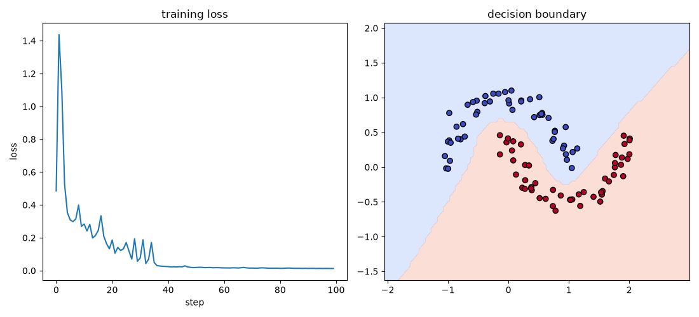

# micrograd-clone

My own from-scratch rebuild of Andrej Karpathy's [micrograd](https://github.com/karpathy/micrograd), done as a learning exercise. A tiny scalar autograd engine (backprop over a dynamically built computation graph) plus a small neural net library on top of it, with a PyTorch-like API. The point was to actually understand backpropagation by implementing it myself instead of calling `.backward()` on a tensor and trusting it works.

I followed the same shape as the original but wrote the code myself rather than copying it, so the naming and structure differ in places.

## example usage

```python
from micrograd.engine import Value

a = Value(3.0)
b = Value(-2.0)
c = a * b + b**2
d = (a - b) / (a + b)
e = c.tanh() + d.relu()
f = e * 3.0 - 1.0
print(f'{f.data:.4f}')   # 11.1079
f.backward()
print(f'{a.grad:.4f}')   # -12.4239
print(f'{b.grad:.4f}')   # -18.2120
```

## what an autograd engine actually is

When you do `z = x * y`, `Value` doesn't just compute the number — it remembers *how* `z` was computed (from `x` and `y`, via multiplication), so later, once you have some final loss value, you can ask "how much would the loss change if I nudged `x` a tiny bit?" for every value in the whole graph, automatically. That's `backward()` — reverse-mode automatic differentiation, applied one scalar at a time.

Once you have that, a neural net is nothing special. It's a chain of `Value` multiplications, additions, and a nonlinearity, and training is: run the graph forward, call `backward()`, nudge every weight a little in the direction that reduces the loss, repeat.

## training a neural net

`examples/train_toy.py` builds a `[2, 16, 16, 1]` MLP from `micrograd.nn`, trains it on a hand-rolled two-moons dataset with an SVM max-margin loss and plain SGD (no Adam, no momentum), and hits 100% training accuracy in under 100 steps:



## structure

```
micrograd/
  engine.py   - the Value class, this is the whole autograd engine
  nn.py       - Neuron, Layer, MLP, built entirely out of Value ops
tests/
  test_engine.py
examples/
  train_toy.py - trains the MLP above and produces the plot
```

## running it

```
pip install -r requirements.txt
pytest tests/
python examples/train_toy.py
```

If you have `torch` installed, `test_engine.py` also runs a test that checks these gradients against PyTorch's autograd on the same computation. It's skipped automatically if torch isn't there.

## why tanh

`engine.py` implements both `tanh` and `relu`, but `Neuron` in `nn.py` defaults to tanh. Mostly because that's what I originally saw this done with, and the smooth gradient made debugging easier when I was checking my backward pass by hand — no dead-neuron problem to worry about while I was still figuring out if my chain rule implementation was even correct. Once the engine was solid, tanh vs relu barely mattered for a toy problem this small, so I never bothered switching the default.

## what I learned

*(filling this in later)*
